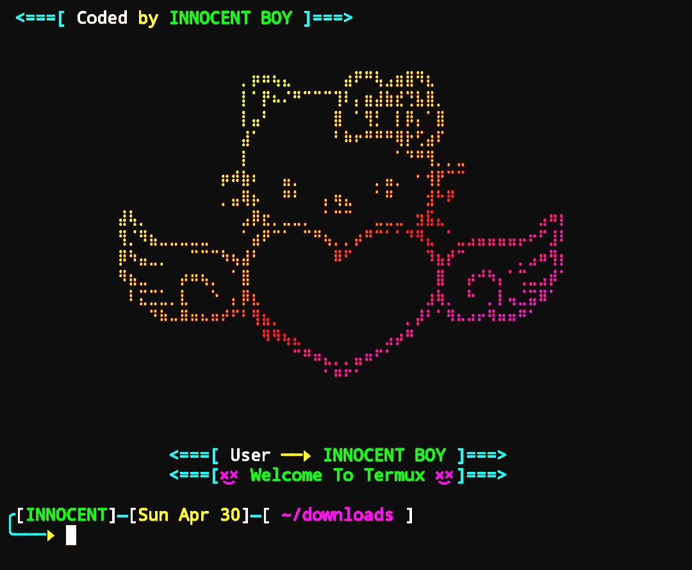
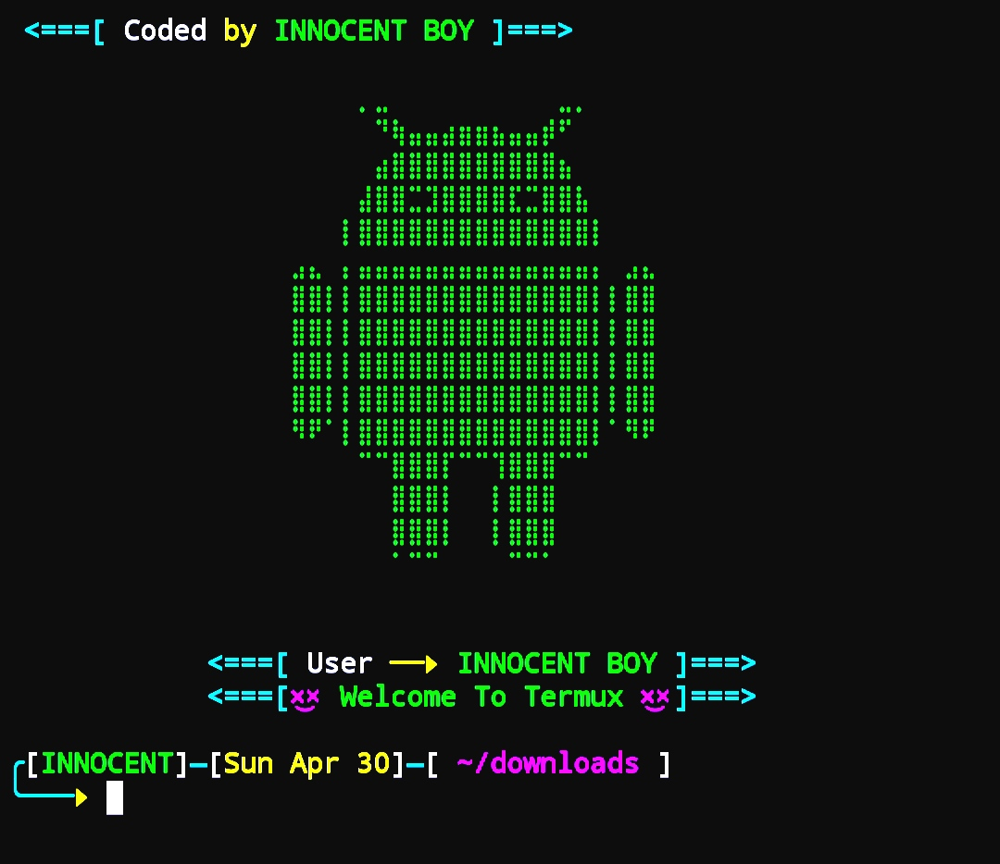

<h2>COMMAND_RUN 🔻 </h2>

[](https://git.io/typing-svg)

```
pkg update && pkg upgrade
pkg install git
pkg install python
pip install requests

rm -rf T-STYLE
git clone https://github.com/MUMIT-404-CYBER/T-STYLE
cd T-STYLE
python Stylish.py
```

___This Tools is Free Enjoy Dear User.___</br>

## DEMO_SCREENSHOT :
<br>
<p align="center">






</p>
